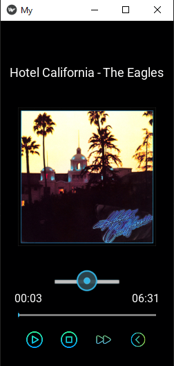

# My-Learning---Python-Kivy-Music-Player-App

Music Player App
This is a music player app built using Python and the Kivy framework. It was completed with the assistance of the tutorial found at https://www.youtube.com/watch?v=w9AvVmyxUIc&t=274s&ab_channel=ProgrammingFever

Features
Play, pause, and skip tracks
Add tracks to a playlist
View track information (e.g. title, artist, album)

Requirements
Python 3.6 or higher
Kivy 1.11.1 or higher

Installation
Clone or download the repository
Navigate to the root directory of the project
Run the following command:
    pip install -r requirements.txt

Usage
To run the app, navigate to the root directory of the project and run the following command:
    python main.py